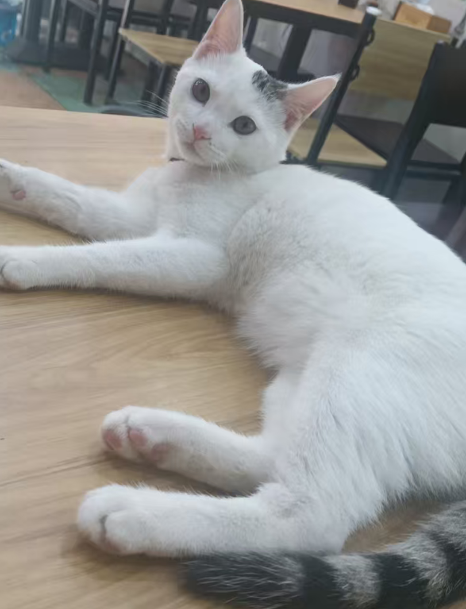
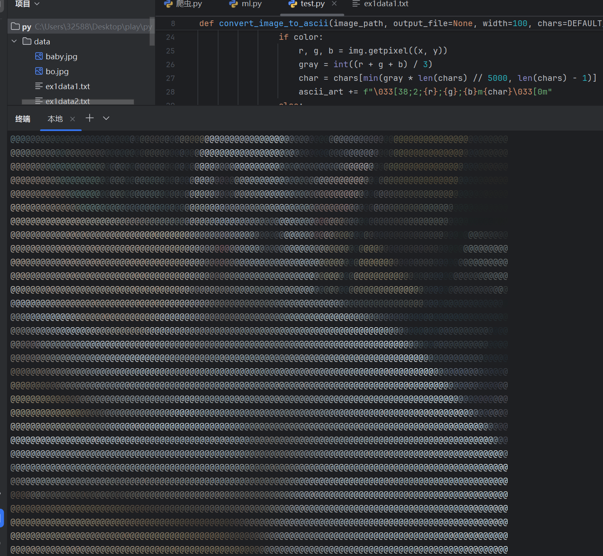

# ASCII Art Generator

将图片转换为彩色/黑白字符画的Python工具，支持自定义字符集和输出尺寸。

 
（示例图片与效果对比)

## 功能特性

- 🌈 支持真彩色输出（兼容现代终端）
- ⚙️ 可自定义字符密度和样式
- 📏 动态调整输出宽度
- 💾 支持保存到文件或直接打印
- 🖌️ 基于ITU-R BT.601标准计算灰度值

## 安装依赖

```bash
pip install Pillow
```

## 使用方法

### 基本命令

```
python ascii_art.py input.jpg
```

### 完整参数

```
python ascii_art.py input.jpg \
    -o output.txt \    # 保存到文件
    -w 80 \            # 设置输出宽度为80字符
    -c "@%#*+=-:. " \  # 自定义字符集
    --no-color         # 禁用彩色输出
```

## 参数说明

| 参数           | 描述                     | 默认值       |
| :------------- | :----------------------- | :----------- |
| `image`        | 输入图片路径 (必需)      | -            |
| `-o, --output` | 输出文件路径             | 控制台打印   |
| `-w, --width`  | 输出宽度（字符数）       | 100          |
| `-c, --chars`  | 自定义字符集（从密到疏） | `@%#*+=-:.`  |
| `--no-color`   | 禁用彩色输出             | 默认启用彩色 |

## 示例效果

### 默认参数

```
python ascii_art.py demo/cat.jpg
```


### 自定义字符集


```
python ascii_art.py demo/cat.jpg -c " .:-=+*#%@@"
```

### 黑白模式

```
python ascii_art.py demo/cat.jpg --no-color -w 120
```

## 进阶技巧

1. **字符集设计原则**：
   - 前密后疏：`"@%#*+=-:. "`
   - 更多细节：`"$@B%8&WM#*oahkbdpqwmZO0QLCJUYXzcvunxrjft/\|()1{}[]?-_+~<>i!lI;:,\"^'. "`
2. **最佳实践**：
   - 风景照建议宽度：80-120字符
   - 人像建议宽度：150-200字符
   - 启用彩色时建议使用深色终端背景

## 注意事项

- 彩色输出需要支持ANSI转义码的终端（推荐使用[Windows Terminal](https://aka.ms/terminal)）
- 处理大尺寸图片时请适当降低输出宽度
- 字符画质量取决于原始图片的对比度

## 贡献指南

欢迎提交：

- 改进灰度计算算法
- 添加GIF支持
- 优化性能（多线程处理）
- 更多字符预设方案